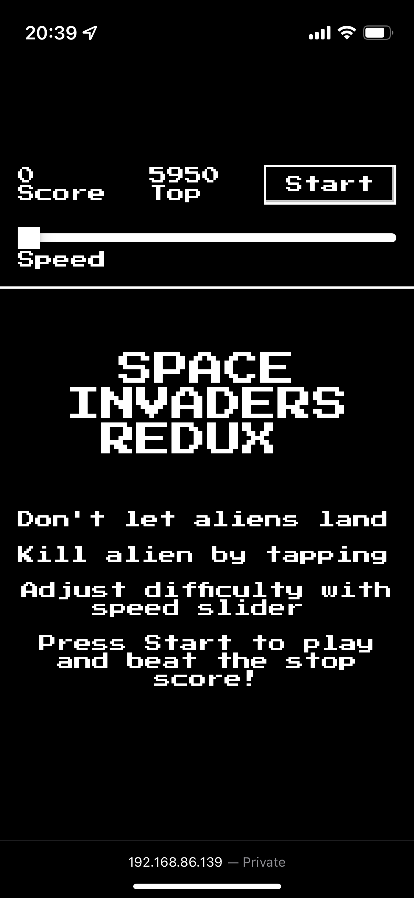
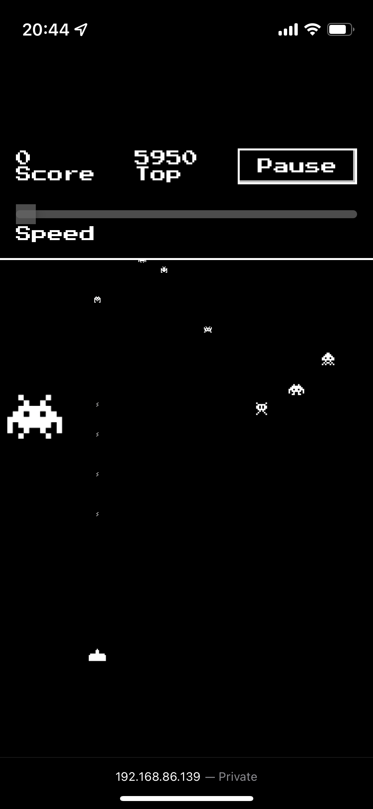
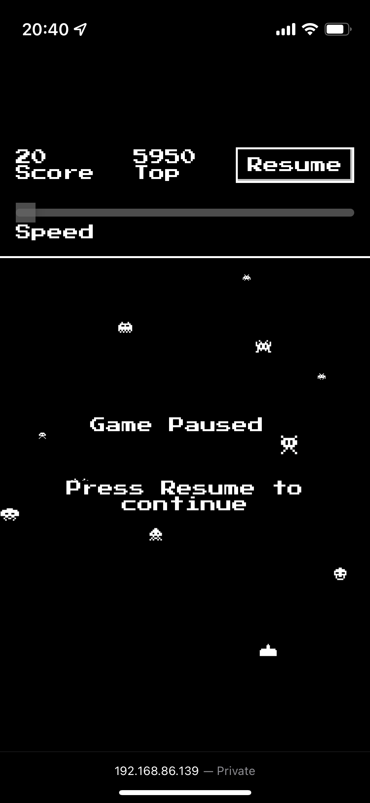
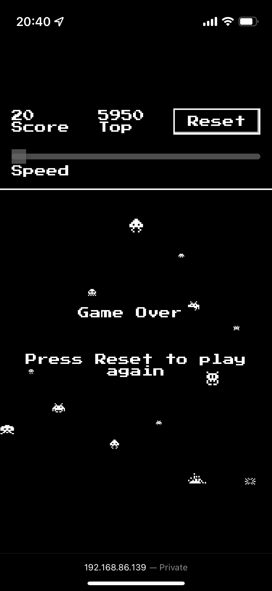

# Space Invaders Redux

Space Invaders. Reimagined.

## Features

- Implemented in plain JavaScript without any libraries/frameworks. Heavily commented source code for readability.
- Styles implemented in plain CSS
- Does not use HTML Canvas but rather normal HTML elements to render the game
- Supports pause/resume. Moreover, it supports auto-pausing if browser tab is hidden on the device's screen.
- Saves game top score in browser's local storage

## Game mechanics

- Aliens fall from the top of the viewport. They come in different sizes.
- A turret is located on the bottom. It fires missiles when alien is tapped by the player.
- The smaller the alien is, the bigger the score. On the slowest speed, the largest alien is worth 1 point while the smallest is 10 points.
- The speed can be adjusted before the start of a game. On top of the base alien hit score, it is multiplied by how fast it moves. The highest possible score in a hit is 100 points.

## Compatibility

The game has been confirmed to work without issues on the following browser engines:

✅ Safari (WebKit) on iOS 15.4

✅ Safari (WebKit) 15.5 on MacOS 12.4 Monterey

✅ Chrome (Blink) 103 on Android 7.0

✅ Chrome (Blink) 103 on Android 12.1.0_r11

✅ Chrome (Blink) 103 on MacOS 12.4 Monterey

✅ Firefox (Gecko) 102 on Android 12.1.0_r11

✅ Firefox (Gecko) 102 on MacOS 12.4 Monterey

Chrome and Firefox in iOS (like other browsers in the platform) also uses WebKit as Safari so these browsers were not included.

### Known Issues

ℹ️ Chrome (Blink) 103 on Android 13 Beta 4 seems to not handle CSS `background-position` property well.

## Screenshots

| State            | Screenshot                                                 |
| ---------------- | ---------------------------------------------------------- |
| Introduction     |             |
| Game in progress |  |
| Game paused      |       |
| Game over        |         |
| Gameplay         |          |

## Development

1. Install Node.js
2. Run this project by executing `npm start` in the command line
